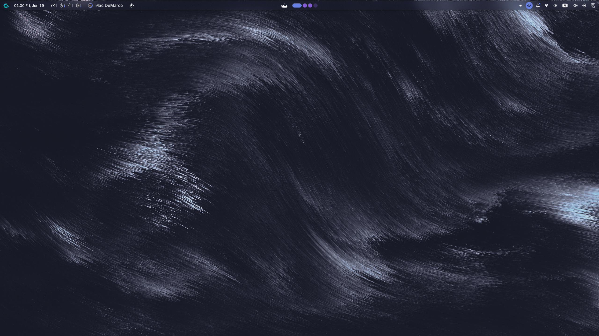
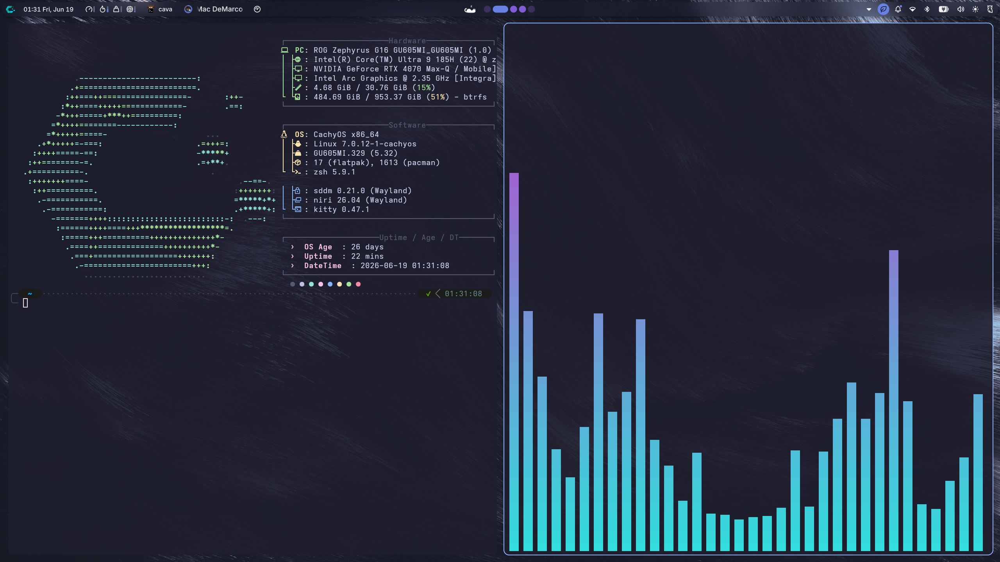
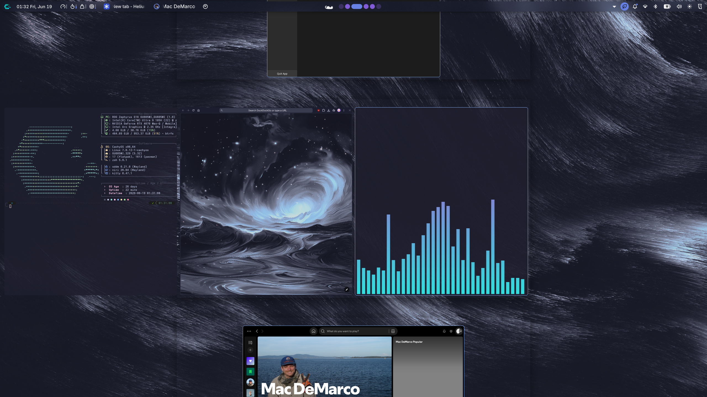
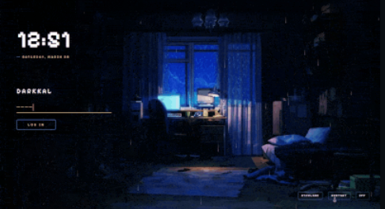
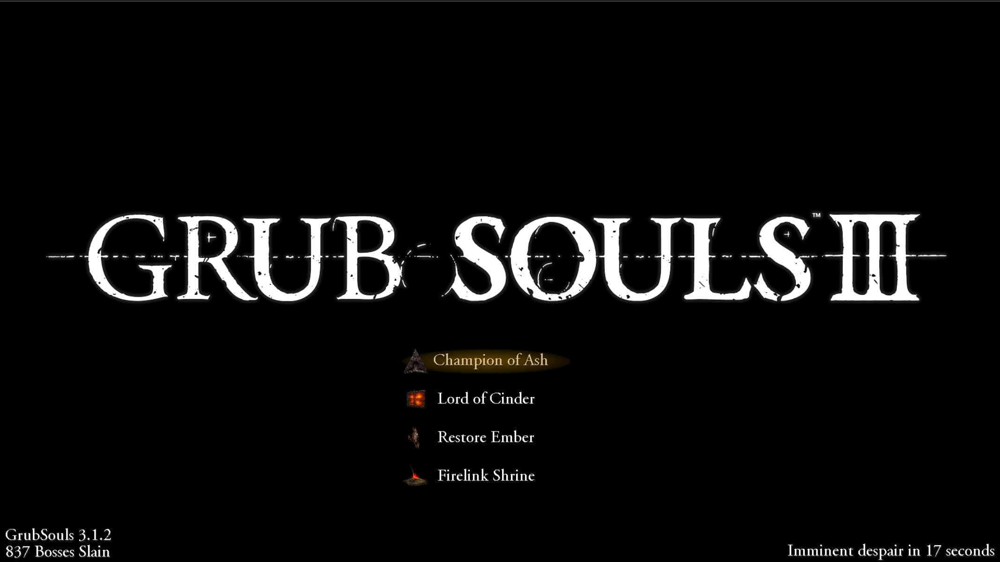

# CachyOS Configuration - ASUS ROG Zephyrus G16

A heavily customized CachyOS setup built around:

* Noctalia
* Niri
* Wayland
* Catppuccin
* NVIDIA + Intel Hybrid Graphics

Designed specifically for an ASUS ROG Zephyrus G16 with an RTX 4070 and Intel Arc iGPU.

---

## Quick Installation

```bash
git clone https://github.com/RiteshwarDunzo/cachyos-config.git
cd cachyos-config

chmod +x install.sh
./install.sh
```

---

## Desktop Environment

### Theme Stack

* Noctalia Session
* Niri Window Manager
* Catppuccin Color Palette
* SDDM (Qylock Themes)
* GRUB (Gorgeous GRUB Themes)
* Kitty Terminal
* Fastfetch
* Zsh + Powerlevel10k
* Helium browser

## Hardware

### Laptop

* ASUS ROG Zephyrus G16 (GU605MI)
* Intel Core Ultra 9
* NVIDIA GeForce RTX 4070 Laptop GPU
* Intel Arc Integrated Graphics
* 32GB RAM

## Software

### Operating System

* CachyOS
* Wayland

### Core Components

* Noctalia
* Niri
* Fastfetch
* Kitty
* EasyEffects
* Btop
* Cava
* Vesktop
* Neovim
* Zsh
* Powerlevel10k

---

## Features

* Noctalia desktop environment
* Catppuccin-inspired theme
* NVIDIA + Intel hybrid graphics
* Automatic monitor detection
* Automatic refresh-rate switching
* External monitor support
* Custom Fastfetch
* Custom Kitty configuration
* Custom Zsh configuration
* Powerlevel10k prompt
* EasyEffects presets
* Gaming-ready setup
* SDDM theme customization
* GRUB theme customization

---

## Hardware-Specific Tweaks

### ASUS ROG Zephyrus G16

Included custom scripts for:

* Automatic monitor switching
* External monitor detection
* Refresh-rate management
* Multi-monitor workflow

## Included Configurations

* Niri
* Noctalia
* Kitty
* Fastfetch
* Btop
* Cava
* EasyEffects
* Neovim
* Vesktop
* Zsh
* Powerlevel10k
* Wallpapers
* Fonts
* SDDM
* GRUB
* Scripts

---

## Repository Structure

```text
.
├── btop/
├── cava/
├── easyeffects/
├── fastfetch/
├── fonts/
├── grub/
├── kitty/
├── niri/
├── noctalia/
├── nvim/
├── packages/
├── screenshots/
├── scripts/
├── sddm/
├── vesktop/
├── wallpapers/
├── zsh/
├── install.sh
└── README.md
```

---

## Package Lists

Package lists are available inside:

```text
packages/
├── packages.txt
```

Install manually if desired:

```bash
sudo pacman -S --needed - < packages/packages.txt
```

---
## Screenshots

### Desktop 









### SDDM



### GRUB




## Zsh Requirements

This setup expects:

* Zsh
* Oh My Zsh
* Powerlevel10k

Install these before applying the Zsh configuration.

---

## Credits

### Noctalia

The overall desktop experience is based on the Noctalia ecosystem running on Wayland with Niri.

### SDDM Themes

Most SDDM themes included or adapted in this repository originate from the Qylock theme collection by Darkkal44.

https://github.com/Darkkal44/qylock

### GRUB Themes

GRUB themes are sourced from the Gorgeous GRUB collection by Jacksaur.

https://github.com/Jacksaur/Gorgeous-GRUB

Huge thanks to all maintainers and contributors.

---

## Disclaimer

This setup is optimized for my ASUS ROG Zephyrus G16.

Monitor identifiers, refresh rates, display configurations, GPU settings, and hardware-specific scripts may require modification on different systems.

Use at your own discretion and review system-level configurations before applying them.

---

